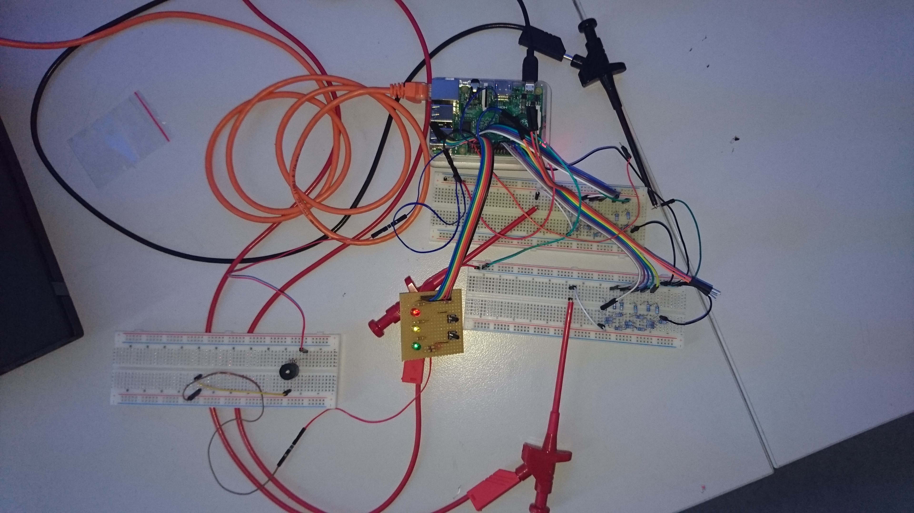

Osziflap
========

A simple flappy bird clone developed during the mini game jam in the
"Künstlerhaus" in Dortmund on 2017-06-10 by Miriam, Marco, and
Reinhard. The game is played on a oscilloscope with a potentiometer
controlling the bird and a button to reset the game. It was developed
in about 8 hours. The analogue signal is generated by a R2R network
driven by some of the (digital) GPIO pins of a RaspberryPi 3.

Demo
----
 and 
