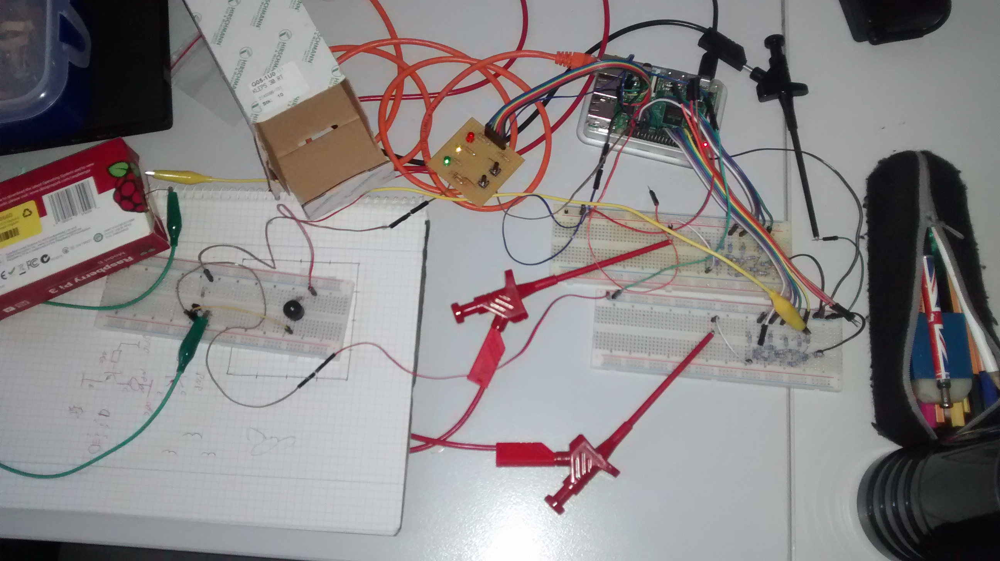
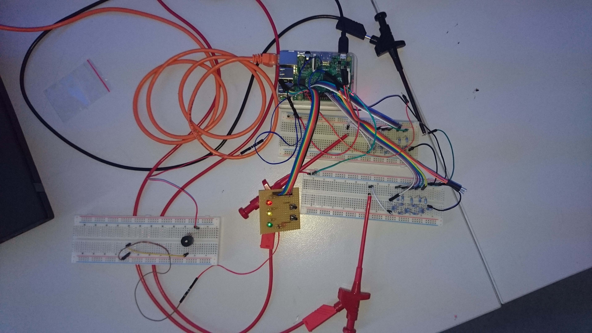
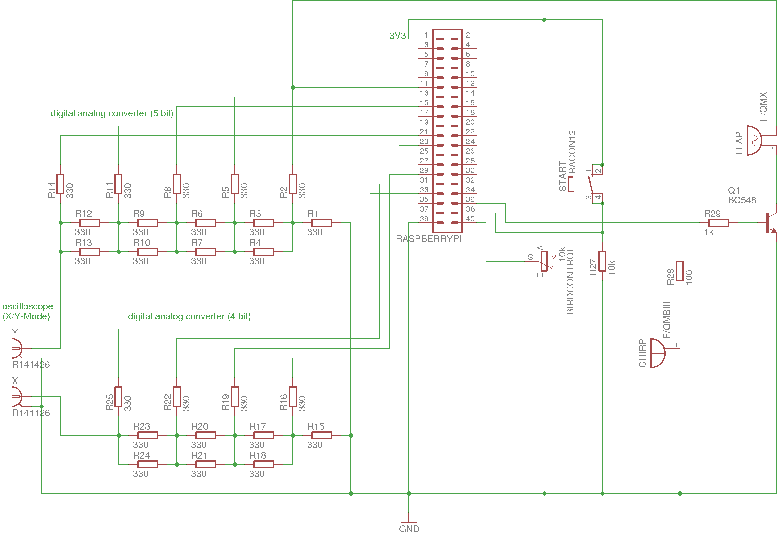
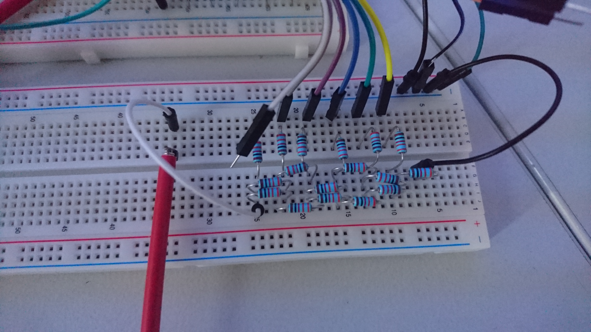
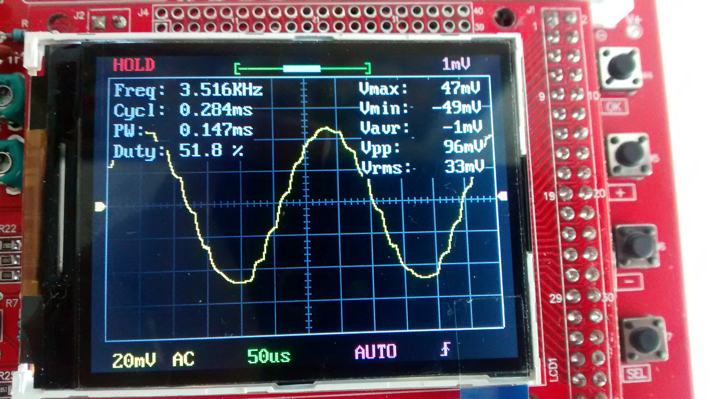
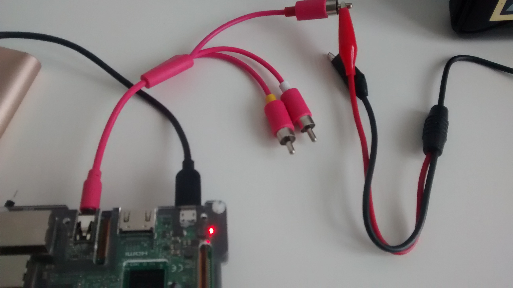

Osziflap
========

A simple flappy bird clone developed during the mini game jam in the
"Künstlerhaus" in Dortmund on 2017-06-10 by Miriam, Marco, and
Reinhard. The game is played on a oscilloscope with a potentiometer
controlling the bird and a button to reset the game. It was developed
in about 8 hours. The analogue signal is generated by a R2R network
driven by some of the (digital) GPIO pins of a RaspberryPi 3.

Demo
----
 and [YouTube](https://www.youtube.com/watch?v=7jtvtk3SSTg)

Version 2 - Audiooutput
-----------------------

A second version uses the audio jack of the raspberry pi to produce an analog 
signal.

The connection is established via an audio to cinch adapter cable.

Links
-----

DA-Wandler

MCP 4921 (SPI): wenige kHz http://shelvin.de/da-wandler-mcp4921-am-arduino/

SPIDEV-Dokumentation:

-    http://tightdev.net/SpiDev_Doc.pdf
-    http://www.netzmafia.de/skripten/hardware/RasPi/RasPi_SPI.html
-    https://raspilab.blog/2014/11/04/analoge-messwerte-mit-einem-adc-uber-spi-auslesen/
    
R2R: 

-    wenige MHz
-    https://en.wikipedia.org/wiki/Resistor_ladder
-    http://shelvin.de/ein-r2r-4-bit-digital-analog-wandler-wird-aufgebaut/
-    http://shelvin.de/ein-rechteck-signal-ausgeben-mit-dem-r-2r-da-wandler/
-    http://shelvin.de/ein-rechteck-sgnal-mit-einstellbarer-frequenz-ausgeben/
    
Weitere Links:

-    https://hackaday.com/2016/05/02/amazing-oscilloscope-graphics/
-    https://hackaday.com/2014/12/29/ultimate-oscilloscope-hack-quake-in-realtime/
-    http://www.kotzendes-einhorn.de/blog/2016-12/sound-zu-grafik-oszilloskop-musik/
    
